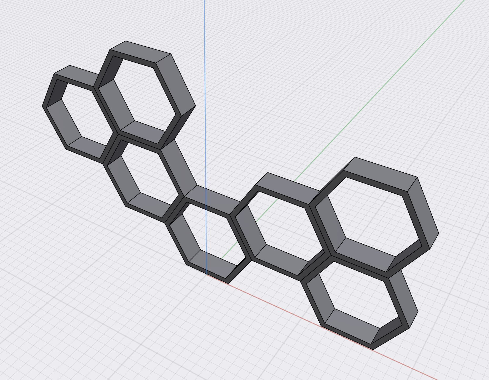

RPi Hex Control - Controlling LEDs with a Raspberry Pi
=============

This project uses a Raspberry Pi Zero W to control a string of (336) sk6812 LEDs.  
The API is made with FastAPI and served with uvicorn. 

## Features

This project uses:
- adafruit-circuitpython-neopixel, adafruit-blinka, ws-281x, and RPi-GPIO to drive the LEDs.
- FastAPI to create the RESTful API
- Uvicorn to serve the API 
- Poetry to manage dependencies
- Docker, for developing and deployment

## Purpose
I built a decorative wall planter and added some individually addressable LEDs.  This lights up my office!

## How?
stream using a React hook and updates the table in real-time!

## Prerequisites
This project needs `Docker` and `docker-compose` installed on your system.

## Setup

## Build

## License
[MIT License](https://opensource.org/licenses/MIT)
